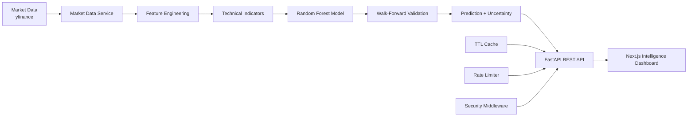

# AI Stock Intelligence Platform

A full-stack machine-learning platform for analyzing historical market data, generating technical indicators, and producing transparent next-session price estimates with validation and uncertainty information.

> **Educational use only.** Market analysis and model predictions are statistical estimates, not financial advice.

## Key Highlights

- Stock and ticker analysis
- Historical OHLCV market data via yfinance
- Technical indicators: SMA, EMA, RSI, MACD, Bollinger Bands and volatility
- Feature engineering with time-series features
- Random Forest regression for next-close estimation
- Walk-forward time-series validation
- MAE, RMSE and R² evaluation metrics
- Prediction uncertainty interval
- Feature-importance reporting
- Bullish, Bearish or Neutral trend classification
- Professional Next.js intelligence dashboard
- FastAPI REST API with typed Pydantic response contracts
- API rate limiting and TTL caching
- Security headers and request logging
- Automated tests and GitHub Actions CI
- Docker and Docker Compose support

## Architecture



### Request Flow

```text
User
  ↓
Next.js Dashboard
  ↓ HTTP
FastAPI API
  ├── Rate Limiting
  ├── TTL Cache
  └── Security Middleware
        ↓
Market Data → Features → ML Model → Validation → Prediction
        ↓
Structured API Response
        ↓
Charts + Indicators + Prediction Interval
```

## ML Pipeline

```text
Historical OHLCV Data
        ↓
Technical Indicators + Lag Features
        ↓
Feature Dataset
        ↓
Random Forest Regressor
        ↓
Walk-Forward Time-Series Validation
        ↓
MAE / RMSE / R²
        ↓
Next-Session Estimate + 95% Prediction Interval
```

## Project Structure

```text
.
├── backend/
│   ├── app/
│   │   ├── api/
│   │   │   ├── routes/
│   │   │   └── schemas.py
│   │   ├── core/
│   │   │   ├── cache.py
│   │   │   ├── config.py
│   │   │   └── security.py
│   │   ├── indicators/
│   │   ├── ml/
│   │   └── services/
│   ├── tests/
│   ├── main.py
│   ├── requirements.txt
│   └── Dockerfile
├── frontend/
│   ├── src/
│   │   ├── app/
│   │   └── components/
│   └── package.json
├── .github/workflows/ci.yml
├── .env.example
├── docker-compose.yml
└── README.md
```

## API Showcase

### Health check

```text
GET /health
```

Example response:

```json
{
  "status": "ok",
  "service": "ai-stock-intelligence-api"
}
```

### Stock intelligence analysis

```text
GET /api/v1/stocks/{ticker}/analysis
```

Example:

```text
/api/v1/stocks/AAPL/analysis?period=2y&history_limit=120
```

The response includes:

```json
{
  "ticker": "AAPL",
  "latest_market": {},
  "technical_indicators": {},
  "prediction": {
    "predicted_next_close": 0,
    "prediction_interval": {
      "lower": 0,
      "upper": 0,
      "confidence_level": 95
    },
    "confidence_score": 0,
    "validation": {
      "method": "walk_forward_time_series"
    },
    "metrics": {
      "mae": 0,
      "rmse": 0,
      "r2": 0
    }
  }
}
```

## Dashboard

The frontend visualizes:

- Current market price
- AI next-session estimate
- Expected percentage change
- Prediction uncertainty range
- Historical closing-price chart
- Technical indicators
- Model quality metrics
- Walk-forward validation metadata
- Top model features

## Local Development

### Backend

```bash
cd backend
python -m venv venv
```

Windows:

```bash
venv\Scripts\activate
```

macOS/Linux:

```bash
source venv/bin/activate
```

Install and run:

```bash
pip install -r requirements.txt
uvicorn main:app --reload
```

Backend API: `http://localhost:8000`

### Frontend

In another terminal:

```bash
cd frontend
npm install
npm run dev
```

Frontend: `http://localhost:3000`

Create frontend environment configuration when needed:

```env
NEXT_PUBLIC_API_BASE_URL=http://localhost:8000
```

## Docker

Start the application stack with:

```bash
docker compose up --build
```

## Testing

Backend tests:

```bash
cd backend
PYTHONPATH=. pytest tests -q
```

The GitHub Actions workflow runs backend tests and the frontend production build on pushes and pull requests.

## Production Considerations

The current implementation includes rate limiting, caching, CORS configuration and security headers. For a multi-instance production deployment, consider:

- Redis-backed caching and distributed rate limiting
- A licensed real-time market-data provider for live prices
- Model version tracking and experiment logging
- Scheduled model evaluation and retraining
- Monitoring and structured observability

## Tech Stack

| Layer | Technology |
|---|---|
| Frontend | Next.js, React, TypeScript, Tailwind CSS, Recharts |
| Backend | Python, FastAPI, Uvicorn, Pydantic |
| ML | scikit-learn, Random Forest |
| Data | Pandas, NumPy, yfinance |
| DevOps | Docker, Docker Compose, GitHub Actions |

## Author

**Pankaj (Tony) Kumar**

AI Engineer • Full Stack Developer • AI/ML Enthusiast

GitHub: https://github.com/hack2ai
LinkedIn: https://www.linkedin.com/in/pankaj-kumar-ab591a216
