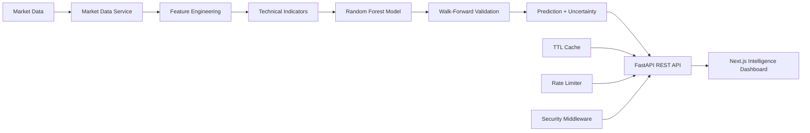

# AI Stock Intelligence Platform

> A full-stack machine-learning platform for analyzing historical stock market data, generating technical indicators, and producing transparent next-session price estimates with validation and uncertainty information.


## Overview

AI Stock Intelligence provides an end-to-end workflow for stock analysis:

1. Enter a stock ticker such as `AAPL`, `TSLA`, or `MSFT`.
2. Fetch historical market data.
3. Calculate technical indicators and engineered features.
4. Run the machine-learning prediction pipeline.
5. Display the predicted next-session close, expected percentage change, market signal, confidence score, model metrics, feature importance, and historical price chart.

The application is designed for educational analysis and does **not** provide financial advice.

## Key Features

- Stock ticker analysis for supported market symbols.
- Historical OHLCV market data.
- Interactive historical closing-price visualization.
- Next-session statistical price estimate.
- Expected percentage change calculation.
- Bullish, bearish, or neutral market signal.
- Model confidence score.
- Technical indicators including SMA, EMA, RSI, MACD, MACD signal, MACD histogram, Bollinger Bands, and volatility features.
- Model evaluation using MAE, RMSE, and R².
- Feature-importance visualization for transparent predictions.
- Input and ticker validation.
- Responsive dark dashboard UI.
- API rate limiting, caching, security headers, and request logging.
- Automated testing and CI support.

## Screenshots

Screenshots from the completed dashboard can be added under `docs/screenshots/`:

- Historical price analysis
- Technical indicators
- Model quality metrics
- Feature importance

## Architecture



## ML Pipeline

```text
Historical OHLCV Data
        ↓
Technical Indicators + Lag Features
        ↓
Feature Dataset
        ↓
Random Forest Regressor
        ↓
Walk-Forward Time-Series Validation
        ↓
MAE / RMSE / R²
        ↓
Next-Session Estimate + Prediction Interval
```

## Technology Stack

| Layer | Technology |
|---|---|
| Frontend | Next.js, React, TypeScript, CSS |
| Backend | Python, FastAPI, Uvicorn, Pydantic |
| Machine Learning | scikit-learn, Random Forest |
| Data Processing | Pandas, NumPy, yfinance |
| DevOps | Docker, Docker Compose, GitHub Actions |
| Quality & Security | Tests, rate limiting, caching, CORS, security headers |

## Project Structure

```text
.
├── backend/
│   ├── app/
│   │   ├── api/
│   │   ├── core/
│   │   ├── indicators/
│   │   ├── ml/
│   │   └── services/
│   ├── tests/
│   ├── main.py
│   ├── requirements.txt
│   └── Dockerfile
├── frontend/
│   ├── src/
│   │   ├── app/
│   │   └── components/
│   └── package.json
├── .github/workflows/
├── docker-compose.yml
└── README.md
```

## API

### Health Check

```http
GET /health
```

### Stock Intelligence Analysis

```http
GET /api/v1/stocks/{ticker}/analysis
```

Example:

```text
/api/v1/stocks/AAPL/analysis?period=2y&history_limit=120
```

The response includes market data, technical indicators, prediction output, confidence information, validation metrics, and feature importance.

Interactive API documentation:

```text
http://127.0.0.1:8000/docs
```

## Local Development

### Backend

```bash
cd backend
python -m venv venv
```

Windows:

```bash
venv\Scripts\activate
```

macOS/Linux:

```bash
source venv/bin/activate
```

Install dependencies and start the API:

```bash
pip install -r requirements.txt
uvicorn main:app --reload
```

Backend API:

```text
http://127.0.0.1:8000
```

### Frontend

Open another terminal:

```bash
cd frontend
npm install
npm run dev
```

Frontend:

```text
http://localhost:3000
```

Optional environment configuration:

```env
NEXT_PUBLIC_API_BASE_URL=http://localhost:8000
```

## Production Build

```bash
cd frontend
npm run build
```

## Docker

```bash
docker compose up --build
```

## Testing

```bash
cd backend
PYTHONPATH=. pytest tests -q
```

## Tested Locally

The application has been tested with:

```text
AAPL
TSLA
MSFT
```

Verified functionality includes successful backend API responses, frontend-to-backend integration, historical-price charts, AI predictions, market signals, technical indicators, model-quality metrics, feature-importance visualization, and a successful frontend production build.

## Model Transparency

The platform exposes more than a single predicted value. It also provides:

- MAE for average absolute prediction error.
- RMSE for larger-error sensitivity.
- R² for explanatory performance.
- Feature importance showing which inputs contribute most to the model.
- Technical indicators for market context.
- Confidence and uncertainty information.

## Production Considerations

The current implementation includes rate limiting, caching, CORS configuration, and security headers. For larger-scale deployment, consider:

- Redis-backed caching and distributed rate limiting.
- Licensed real-time market-data providers.
- Model version tracking and experiment logging.
- Scheduled model evaluation and retraining.
- Monitoring and structured observability.

## Roadmap

- [ ] Real-time market-data provider integration
- [ ] Portfolio tracking
- [ ] Stock watchlists
- [ ] Stock comparison
- [ ] News and sentiment analysis
- [ ] Scheduled prediction alerts
- [ ] Model version tracking
- [ ] Cloud deployment

## Disclaimer

This project is intended for **education, research, and demonstration purposes**. Machine-learning predictions are statistical estimates and do not guarantee future market performance.

Do not use this application as the sole basis for investment decisions.

## Author

**Pankaj (Tony) Kumar**

AI Engineer · Full Stack Developer · AI/ML Enthusiast

- GitHub: https://github.com/hack2ai
- LinkedIn: https://www.linkedin.com/in/pankaj-kumar-ab591a216

---

**AI Stock Intelligence Platform** — turning historical market data into structured, machine-learning-powered insights.
