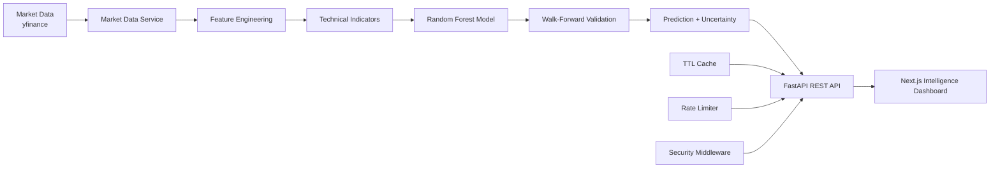

# 📈 AI Stock Intelligence Platform

<p align="center">
  <strong>AI-powered stock market analysis using technical indicators, time-series validation, and machine-learning price estimation.</strong>
</p>

<p align="center">
  <a href="https://github.com/hack2ai/ai-stock-predictor"></a>
  
  
  
  
</p>

> **Educational use only.** Market analysis and model predictions are statistical estimates and are **not financial advice**.

---

## Overview

**AI Stock Intelligence Platform** is a full-stack machine-learning application for analyzing historical stock-market data and producing transparent next-session price estimates.

The platform combines historical OHLCV data, technical indicators, feature engineering, **Random Forest regression**, and **walk-forward time-series validation**. Results are delivered through a FastAPI REST API and visualized in a professional Next.js dashboard.

### What the platform provides

- Historical market-data analysis
- Technical indicators and volatility features
- Machine-learning next-close estimation
- Expected percentage change and market signal
- Prediction confidence and uncertainty interval
- MAE, RMSE, and R² model metrics
- Feature-importance reporting
- Interactive historical-price visualization
- Typed REST API responses
- API rate limiting and TTL caching
- Security headers and request logging
- Automated tests and GitHub Actions CI
- Docker and Docker Compose support

---

## Key Features

### 📊 Market Analysis

Analyze a stock ticker using historical OHLCV data obtained through `yfinance`.

### 📈 Technical Indicators

The analysis pipeline includes:

- SMA
- EMA
- RSI
- MACD
- Bollinger Bands
- Volatility features

### 🤖 Machine Learning

- Random Forest regression
- Time-series feature engineering
- Next-session closing-price estimation
- Feature-importance analysis

### 🧪 Model Validation

The model is evaluated using **walk-forward time-series validation** with:

- **MAE** — Mean Absolute Error
- **RMSE** — Root Mean Squared Error
- **R²** — Coefficient of determination

### 🎯 Prediction Intelligence

Each analysis can provide:

- Predicted next close
- Expected percentage change
- Bullish, Bearish, or Neutral signal
- Confidence score
- Prediction interval
- AI explanation and interpretation

### 🖥️ Interactive Dashboard

The Next.js dashboard visualizes:

- Current market price
- AI next-session estimate
- Expected percentage change
- Prediction uncertainty range
- Historical closing-price chart
- Market snapshot
- Technical indicators
- Model-quality metrics
- Walk-forward validation metadata
- Top model features

---

## Architecture



### Request Flow

```text
User
  ↓
Next.js Dashboard
  ↓ HTTP
FastAPI API
  ├── Rate Limiting
  ├── TTL Cache
  └── Security Middleware
        ↓
Market Data → Features → ML Model → Validation → Prediction
        ↓
Structured API Response
        ↓
Charts + Indicators + Prediction Interval
```

---

## ML Pipeline

```text
Historical OHLCV Data
        ↓
Technical Indicators + Lag Features
        ↓
Feature Dataset
        ↓
Random Forest Regressor
        ↓
Walk-Forward Time-Series Validation
        ↓
MAE / RMSE / R²
        ↓
Next-Session Estimate + Prediction Interval
```

---

## Technology Stack

| Layer | Technology |
|---|---|
| Frontend | Next.js, React, TypeScript, Tailwind CSS, Recharts |
| Backend | Python, FastAPI, Uvicorn, Pydantic |
| Machine Learning | scikit-learn, Random Forest |
| Data Processing | Pandas, NumPy, yfinance |
| DevOps | Docker, Docker Compose, GitHub Actions |
| Quality & Security | Automated tests, rate limiting, caching, CORS, security headers |

---

## Project Structure

```text
.
├── backend/
│   ├── app/
│   │   ├── api/
│   │   │   ├── routes/
│   │   │   └── schemas.py
│   │   ├── core/
│   │   │   ├── cache.py
│   │   │   ├── config.py
│   │   │   └── security.py
│   │   ├── indicators/
│   │   ├── ml/
│   │   └── services/
│   ├── ml_model/
│   ├── tests/
│   ├── main.py
│   ├── requirements.txt
│   └── Dockerfile
├── frontend/
│   ├── src/
│   │   ├── app/
│   │   └── components/
│   └── package.json
├── .github/workflows/ci.yml
├── .env.example
├── docker-compose.yml
├── .gitignore
└── README.md
```

---

## API

### Health Check

```http
GET /health
```

Example response:

```json
{
  "status": "ok",
  "service": "ai-stock-intelligence-api"
}
```

### Stock Intelligence Analysis

```http
GET /api/v1/stocks/{ticker}/analysis
```

Example:

```text
/api/v1/stocks/AAPL/analysis?period=2y&history_limit=120
```

The response includes market data, technical indicators, prediction output, confidence information, validation metrics, and feature importance.

### Interactive API Documentation

After starting the backend, open:

```text
http://127.0.0.1:8000/docs
```

---

## Local Development

### Backend

```bash
cd backend
python -m venv venv
```

**Windows:**

```bash
venv\Scripts\activate
```

**macOS/Linux:**

```bash
source venv/bin/activate
```

Install dependencies and start the API:

```bash
pip install -r requirements.txt
uvicorn main:app --reload
```

Backend API:

```text
http://127.0.0.1:8000
```

### Frontend

Open another terminal:

```bash
cd frontend
npm install
npm run dev
```

Frontend:

```text
http://localhost:3000
```

Optional frontend environment configuration:

```env
NEXT_PUBLIC_API_BASE_URL=http://localhost:8000
```

---

## Production Build

Verify the frontend production build with:

```bash
cd frontend
npm run build
```

---

## Docker

Start the application stack with:

```bash
docker compose up --build
```

---

## Testing

Run backend tests:

```bash
cd backend
PYTHONPATH=. pytest tests -q
```

The GitHub Actions workflow runs backend tests and the frontend production build on repository pushes and pull requests.

---

## Tested Locally

The application has been successfully tested with:

```text
AAPL
TSLA
MSFT
```

Verified functionality includes:

- Successful backend API responses
- Frontend-to-backend integration
- Historical-price charts
- AI predictions
- Market signals
- Technical indicators
- Model-quality metrics
- Feature-importance visualization
- Successful frontend production build

---

## Screenshots

Project screenshots can be added to a `screenshots/` directory and displayed here, for example:

```text
screenshots/
├── dashboard.png
├── stock-analysis.png
├── historical-chart.png
├── technical-indicators.png
└── model-quality.png
```

---

## Production Considerations

The current implementation includes rate limiting, caching, CORS configuration, and security headers. For larger-scale production deployment, consider:

- Redis-backed caching and distributed rate limiting
- Licensed real-time market-data providers
- Model version tracking and experiment logging
- Scheduled model evaluation and retraining
- Monitoring and structured observability

---

## Roadmap

- [ ] Real-time market-data provider integration
- [ ] Portfolio tracking
- [ ] Stock watchlists
- [ ] Stock comparison
- [ ] News and sentiment analysis
- [ ] Scheduled prediction alerts
- [ ] Model version tracking
- [ ] Cloud deployment
- [ ] Production real-time streaming

---

## Disclaimer

This project is intended for **education, research, and demonstration purposes**. Machine-learning predictions are statistical estimates and do not guarantee future market performance.

Do not use this application as the sole basis for investment decisions. Always conduct independent research and consult a qualified financial professional where appropriate.

---

## Author

**Pankaj (Tony) Kumar**

AI Engineer · Full Stack Developer · AI/ML Enthusiast

- GitHub: https://github.com/hack2ai
- LinkedIn: https://www.linkedin.com/in/pankaj-kumar-ab591a216

---

<p align="center">
  <strong>📈 AI Stock Intelligence Platform</strong><br>
  Turning historical market data into structured, machine-learning-powered insights.
</p>
